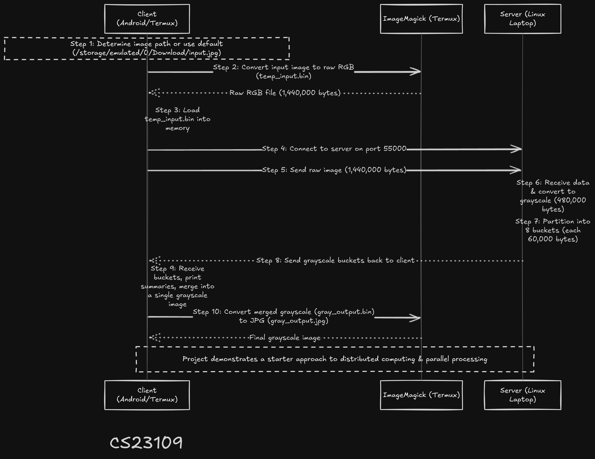
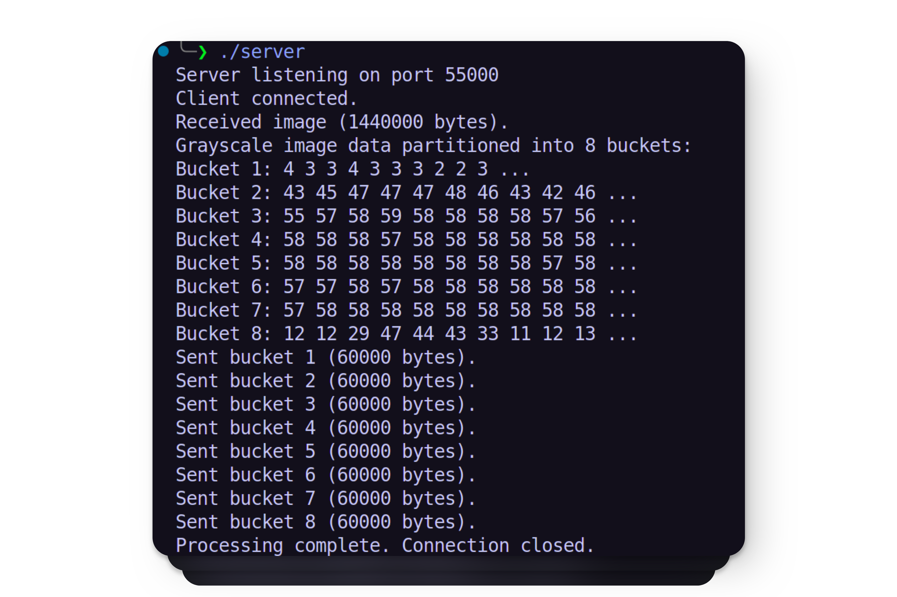
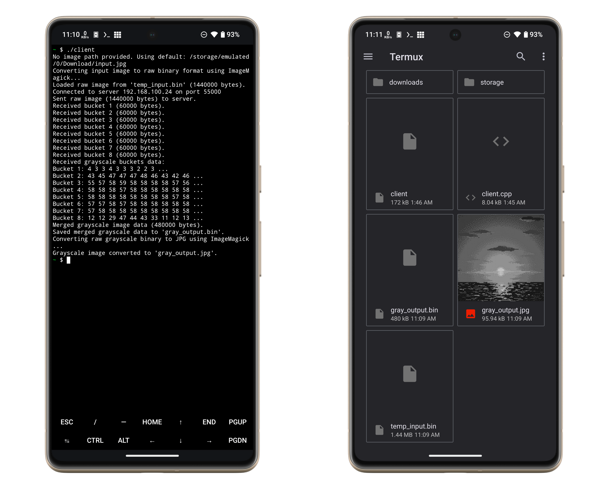

# Socket-Based Grayscale Image Bucketing System

## Overview

As an assignment for my **Algorithms course at ITU**, I built a simple client-server system to learn the basics of socket programming and distributed computing. The goal is to process an image by converting it to grayscale and partitioning the data into 8 buckets—all over a network. In this system, the client converts an input image (JPG/PNG/etc.) to a raw RGB binary, sends it to the server, and the server processes the image (grayscale conversion and bucketing) and sends the results back. The client then merges the buckets, saves the final raw grayscale image, and converts it to a JPG using ImageMagick.



## Motivation and Intuition

I wanted to understand how to split a task between multiple systems. It’s amazing to see how a simple image processing task can be divided across a network—a concept that scales up to more complex parallel and distributed computing systems. Through this project, I hope to share my learning experience and provide a solid starting point for anyone new to socket programming and distributed computing.

## Features

- **Image Conversion:** Uses ImageMagick to convert images from common formats (JPG, PNG, etc.) to a raw RGB binary file.
- **Socket Communication:** The client sends the raw image data to a server over TCP/IP.
- **Image Processing:** The server converts the RGB image to grayscale by averaging the R, G, and B values.
- **Data Partitioning:** The server splits the grayscale image into 8 equal buckets, demonstrating simple data segmentation.
- **Data Transmission & Merging:** The server sends the 8 buckets back to the client, which then merges them into a complete grayscale image.
- **Final Conversion:** The client uses ImageMagick to convert the raw grayscale data back into a JPG image.

## Technical Details

**Programming Language & Environment:**  
- **Language:** C++
- **Development Environment:**  
  - **Server:** Compiled and run on a Linux system using the `g++` compiler.  
  - **Client:** Developed on Android via Termux, compiled using `clang++`.  
- **Libraries & Tools:**  
  - **Standard Library:** Utilizes STL containers like `vector` and `string` for data management.  
  - **POSIX Sockets:** The project relies on standard POSIX socket APIs (e.g., `socket()`, `bind()`, `listen()`, `accept()`, `connect()`, `send()`, `recv()`, `close()`) for TCP/IP network communication.  
  - **ImageMagick:** The `magick` command (from ImageMagick v7) is used to convert input images (JPG, PNG, etc.) to a raw binary format and to convert raw grayscale data back into a JPG. This external tool is invoked via the `system()` call in C++.

**Network Communication:**  
- **Protocol:** Uses TCP (Transmission Control Protocol) over IPv4 for reliable, connection-oriented communication.  
- **Socket Operations:**  
  - The **server** creates a listening socket on a predefined port (55000), binds to all available network interfaces (INADDR_ANY), and accepts an incoming connection from the client.  
  - The **client** initiates a connection to the server using its hard-coded IP address.  
  - Data transfer between client and server is performed in a blocking manner; both sides check return values for errors to ensure complete and correct data transmission.

**Image Processing Pipeline:**  
- **Image Specifications:**  
  - **Resolution:** 800x600 pixels  
  - **Color Channels:** 3 (RGB)  
  - **Raw Data Size:**  
    - **RGB Image:** 800 x 600 x 3 = 1,440,000 bytes  
    - **Grayscale Image:** 800 x 600 = 480,000 bytes  
- **Client Side Processing:**  
  - **Conversion to Raw:** The client uses ImageMagick to convert an input image from common formats (JPG/PNG) into a raw RGB binary file (`temp_input.bin`). The command used specifies resizing to 800x600, 8-bit depth, and the RGB colorspace.  
  - **Sending Data:** The raw RGB data is read into a vector and sent over the network to the server.
- **Server Side Processing:**  
  - **Grayscale Conversion:** Upon receiving the RGB data, the server computes a grayscale value for each pixel using the average of the R, G, and B components.  
  - **Data Partitioning:** The resulting grayscale image (480,000 bytes) is split into 8 equal buckets, each containing 60,000 bytes. This demonstrates basic data partitioning, an essential concept in distributed computing.
  - **Bucket Summary:** For debugging and clarity, the server prints a summary (first 10 values) of each bucket.
- **Return Path & Final Conversion:**  
  - The server sends each bucket back to the client.  
  - The client receives these buckets, prints a summary for verification, and merges them into a complete grayscale image.  
  - The merged data is saved as a raw file (`gray_output.bin`), and ImageMagick is then used to convert this raw grayscale data into a JPEG image (`gray_output.jpg`).

**Design Considerations & Distributed Computing Principles:**  
- **Modular Code Structure:** Both the client and server code are modularized into functions to improve readability, maintainability, and ease of future expansion. This organization is crucial when scaling to more complex distributed systems.  
- **Distributed Processing Concept:** The project is a simple demonstration of splitting an image processing task between a client and a server. Although basic, it introduces the idea of offloading computation to remote systems—a core concept in parallel and distributed computing.  
- **Scalability & Future Extensions:** While the current implementation uses a single server-client model, the techniques used here (data partitioning, network communication, and distributed processing) can be extended to multi-server architectures, enabling true parallel processing for more complex tasks.

## How to Run

### Server Setup (Linux)

1. **Install Dependencies:** Make sure you have a C++ compiler (like `g++`) installed.
2. **Compile the Server:**
   ```bash
   g++ server.cpp -o server
   ```
3. **Run the Server:**
   ```bash
   ./server
   ```

### Client Setup (Termux)

1. **Install Dependencies:**  
   Install `clang++` and ImageMagick on Termux:
   ```bash
   pkg install clang
   pkg install imagemagick
   ```
2. **Compile the Client:**
   ```bash
   clang++ client.cpp -o client
   ```
3. **Run the Client:**  
   The client uses a default image path of `/storage/emulated/0/Download/input.jpg` if none is provided. You can run:
   ```bash
   ./client /storage/emulated/0/Download/input.jpg
   ```
   or simply:
   ```bash
   ./client
   ```
   (If no argument is provided, the program defaults to the above path.)

## Code Structure

### Client

- **convertImageToRaw:** Uses ImageMagick to convert the input image to a raw RGB binary file (`temp_input.bin`).
- **loadRawImage:** Loads the raw image from the file into a vector.
- **connectToServer:** Establishes a TCP connection to the server.
- **sendImageData:** Sends the raw image data to the server.
- **receiveBuckets:** Receives 8 buckets of processed (grayscale) data from the server.
- **printBucketsSummary:** Prints a quick summary (first 10 pixel values) for each bucket.
- **mergeBuckets:** Merges the 8 buckets into one complete grayscale image.
- **saveGrayscaleRawImage:** Saves the merged grayscale image as a raw binary file.
- **convertRawToJPG:** Converts the raw grayscale image to a JPG using ImageMagick.

### Server

- **createServerSocket, bindAndListen, acceptClient:** Set up the server socket, bind it to a port, and accept a connection.
- **receiveImageData:** Receives the raw RGB image from the client.
- **convertToGrayscale:** Converts the RGB image to grayscale.
- **partitionIntoBuckets:** Splits the grayscale image into 8 equal buckets.
- **printBucketsSummary:** Prints a summary of each bucket.
- **sendBucketsData:** Sends the 8 buckets back to the client.

## Output & Screenshots

Some screenshots showing the output of the system in action:

1. **Input Image (Sent by Client)**
  
> This is the original image selected by the client. The client reads this image from the specified path (`/storage/emulated/0/Download/input.jpg`), converts it to raw RGB format, and sends it to the server for processing.

2. **Server Output:**
   
   > This screenshot shows the server receiving the raw image data, converting it to grayscale, partitioning it into 8 buckets, and sending them back to the client.

3. **Client Output:**
   
   > This screenshot illustrates the client sending the raw image, receiving the grayscale buckets, and merging them into a final image.

4. **Final Grayscale Image:**
   
   > This is the actual grayscale image saved by the client after merging all buckets.


### Why Not OpenCV for This Project? (For Now)

1. **Learning Focus:**  
   My main goal was to get hands-on experience with socket programming and distributed computing. I wanted to focus on connecting my Android device (using Termux) with my Linux laptop and dividing a simple image processing task (grayscale conversion and bucketing) between them. Adding OpenCV would have introduced extra complexity that wasn’t necessary for these core objectives.

2. **Termux Limitations:**  
   Currently, OpenCV isn’t available in the default Termux repository. Installing OpenCV in Termux typically involves compiling from source, which can be challenging and time-consuming—especially for someone new to network programming. Using external tools like ImageMagick provided a simpler, more accessible approach.

3. **Simplicity for a Starter Project:**  
   OpenCV is a powerful library with many advanced image processing functions, making it an excellent choice for medium or large-scale projects. However, for a basic project like this, the extra setup and learning curve would have deviated from my goal of understanding the fundamentals of socket-based distributed computing.

4. **Future Scalability:**  
   Once I have mastered the basics, I plan to explore more robust image processing solutions. In a future, more complex project, I’d definitely consider using OpenCV to leverage its built-in functionalities. For now, sticking with the current approach keeps the project focused and the setup straightforward.

## Future Enhancements

- **OpenCV Integration:**  
  In the future, I plan to integrate OpenCV directly into the project to handle image processing tasks within the C++ code. This will eliminate the need for external tools like ImageMagick and allow for more efficient and flexible operations, such as advanced filtering, feature extraction, and real-time image analysis.

- **Multi-Client Distributed Processing:**  
  I want to evolve the project from a single client-server model to a distributed system where the server (laptop) can connect with multiple Android devices simultaneously. In this setup, the server will evenly distribute the image buckets among all connected clients. Each client will process its assigned bucket independently, and the processed results will then be sent back to the server for aggregation.  
  - **Technical Details:**  
    - The server will maintain a dynamic list of connected clients and implement a simple load balancing mechanism to assign buckets.  
    - For example, if there are four connected devices, each client might be assigned two buckets (or one bucket if fewer are connected), ensuring an even workload distribution.  
    - Communication protocols may be enhanced using asynchronous or multi-threaded socket programming to manage concurrent client connections efficiently.  
    - Future implementations might also explore messaging libraries (like ZeroMQ) for more robust and scalable distributed communication.

- **Improved Error Handling:**  
  Adding more robust error checking and recovery mechanisms to better handle network issues and data transmission errors.

- **Parallel Processing:**  
  Investigating how to parallelize parts of the image processing pipeline, possibly by using multi-threading or GPU acceleration on the server side, to further reduce processing time.

- **Scalability:**  
  Extending the system to handle larger images or even multiple servers, paving the way for more complex and scalable distributed computing architectures.

- **User Interface:**  
  Developing a graphical user interface (GUI) for easier interaction with the system, making it more user-friendly and accessible to a wider audience.

- **Advanced Distributed Computing:**  
  Building on this project to explore more advanced topics in distributed and parallel computing, laying the groundwork for a robust network of processing nodes in the future.